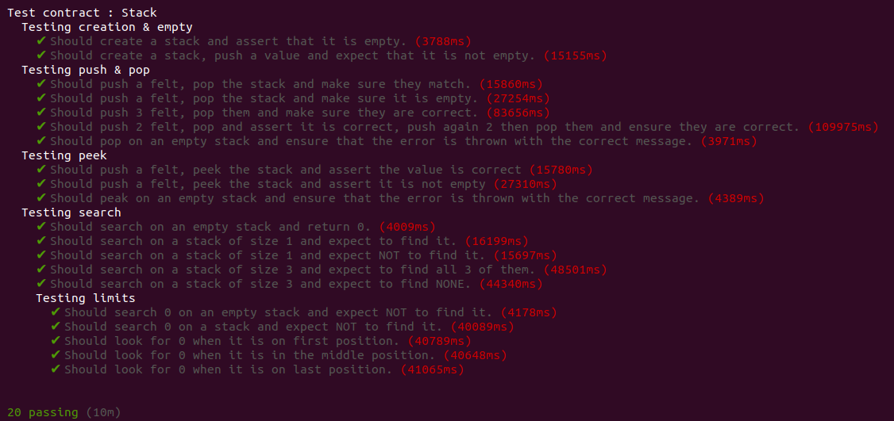

# Setup

You need a cairo envrionement to follow, I suggesst you doing [this](https://www.cairo-lang.org/getting-started/).  
Afterwards, you can create a hardhat environment
To setup the environment, follow [this tutorial](https://symbonstark.surge.sh/?fbclid=IwAR0Fsl4QmID936P8Pu4UNFecCrQgYJa2wI92j768JMWP1T7I_RVJlihXYA4#/step/2) 

# Description

This project had for main objective to install hardhat, and understand how to write tests.  
Maybe I'll add more data structure in the future, so keep posted!

This is a simple Stack (FIFO).  
You can either use it in your own contract or deploy it and use it as an external contract.  
It is based on two variables: 
- caller_address: the address who calls this contract. This is automatically handled by the contract
- identification: the identification you want to give to this stack. You have to specify it.

Here are the methods you can call: 

+ view: empty(identification : felt) -> (isEmpty : felt)
+ view: search(identification : felt, valueToSearch : felt) -> (containsValue : felt)
+ view: peek(identification : felt) -> (peekedValue : felt)
+ external: push(identification : felt, valueToPush : felt) -> (pushedValue : felt)
+ external: pop(identification : felt) -> (poppedValue : felt)

Feel free to use it!

# Tests
At the moment there are 20 tests covering this implementation:   

